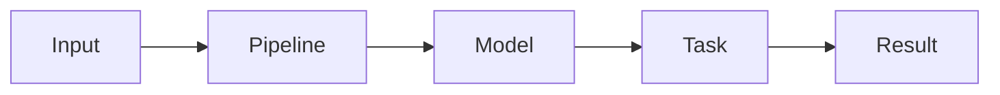
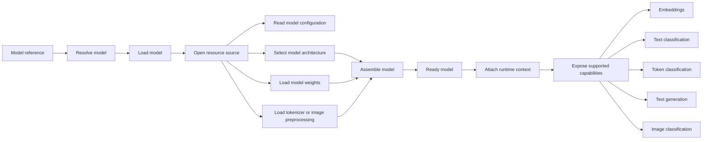
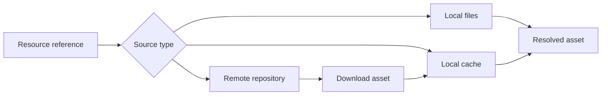

# AI

Artificial intelligence pipelines/models for executing inference tasks on
different input types like images/audio/text.

## Pipelines

```mermaid
flowchart LR
    Input --> Pipeline
    Pipeline --> Model
    Model --> Task
    Task --> Result
```

## Models

```mermaid
flowchart LR
    Model["Model reference"] --> Resolve["Resolve model"]
    Resolve --> Load["Load model"]

    Load --> Source["Open resource source"]
    Source --> Config["Read model configuration"]
    Source --> Architecture["Select model architecture"]
    Source --> Weights["Load model weights"]
    Source --> Metadata["Load tokenizer or image preprocessing"]

    Architecture --> Assemble["Assemble model"]
    Weights --> Assemble
    Metadata --> Assemble

    Assemble --> Ready["Ready model"]
    Ready --> Context["Attach runtime context"]
    Context --> Capabilities["Expose supported capabilities"]

    Capabilities --> Embed["Embeddings"]
    Capabilities --> Classify["Text classification"]
    Capabilities --> TokenClassify["Token classification"]
    Capabilities --> Generate["Text generation"]
    Capabilities --> VisionClassify["Image classification"]
```

## Resources

```mermaid
flowchart LR
    Resource["Resource reference"] --> Source{Source type}
    Source --> Local["Local files"]
    Source --> Cache["Local cache"]
    Source --> Remote["Remote repository"]
    Remote --> Download["Download asset"]
    Download --> Cache
    Local --> Asset["Resolved asset"]
    Cache --> Asset
```
