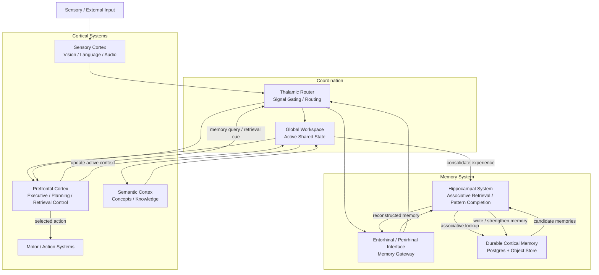

```mermaid
flowchart TD
    Input["Sensory / External Input"]

    subgraph Cortex["Cortical Systems"]
        PFC["Prefrontal Cortex\nExecutive / Planning / Retrieval Control"]
        Semantic["Semantic Cortex\nConcepts / Knowledge"]
        Sensory["Sensory Cortex\nVision / Language / Audio"]
        Motor["Motor / Action Systems"]
    end

    subgraph Memory["Memory System"]
        HPC["Hippocampal System\nAssociative Retrieval / Pattern Completion"]
        EC["Entorhinal / Perirhinal Interface\nMemory Gateway"]
        Store["Durable Cortical Memory\nPostgres + Object Store"]
    end

    subgraph Routing["Coordination"]
        TH["Thalamic Router\nSignal Gating / Routing"]
        WS["Global Workspace\nActive Shared State"]
    end

    Input --> Sensory
    Sensory --> TH
    TH --> WS

    WS --> PFC

    PFC -->|"memory query / retrieval cue"| TH
    TH --> EC
    EC --> HPC

    HPC -->|"associative lookup"| Store
    Store -->|"candidate memories"| HPC

    HPC -->|"reconstructed memory"| EC
    EC --> TH
    TH --> PFC

    PFC -->|"update active context"| WS
    WS --> Semantic
    Semantic --> WS

    PFC -->|"selected action"| Motor

    WS -->|"consolidate experience"| HPC
    HPC -->|"write / strengthen memory"| Store
```
