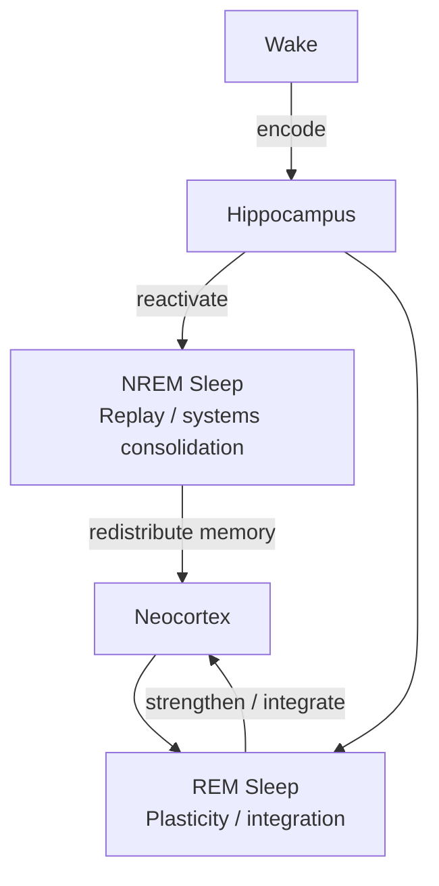

```mermaid
flowchart TD
    Wake["Wake"]
    HPC["Hippocampus"]
    Cortex["Neocortex"]

    NREM["NREM Sleep\nReplay / systems consolidation"]
    REM["REM Sleep\nPlasticity / integration"]

    Wake -->|"encode"| HPC

    HPC -->|"reactivate"| NREM
    NREM -->|"redistribute memory"| Cortex

    Cortex --> REM
    HPC --> REM

    REM -->|"strengthen / integrate"| Cortex
```
