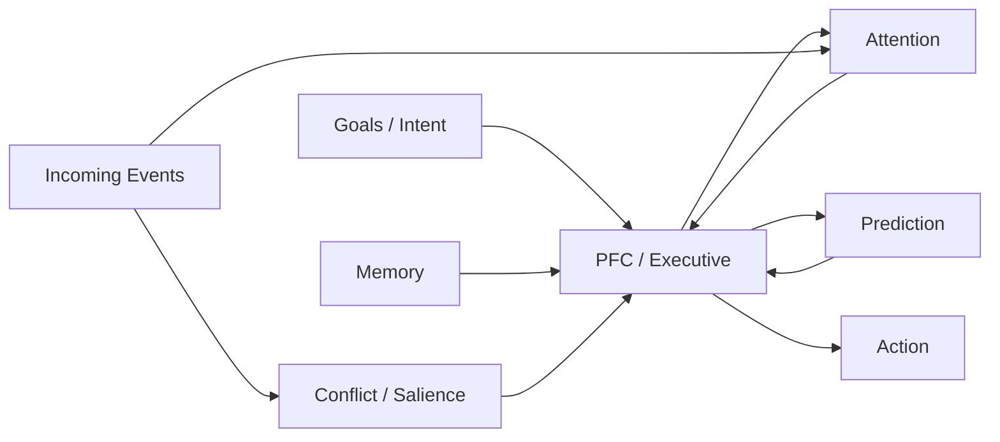

```
goal remains active
      ↓
PFC continuously maintains context
      ↓
predict likely future states
      ↓
retrieve relevant memories
      ↓
pre-activate attention / plans / actions
      ↓
event happens
      ↓
already prepared
```
